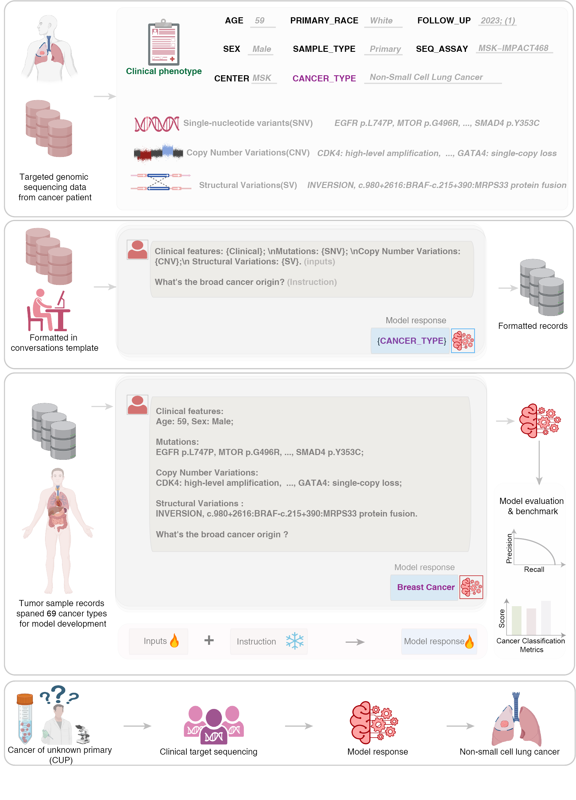

#  Large language models enable tumor-type classification and localization of cancers of unknown primary from genomic data (OncoChat)


## Introduction
Recent advances in artificial intelligence (AI) have highlighted the potential of large language models (LLMs) to revolutionize medical research. Models based on architectures such as Generative Pre-Training (GPT) and Bidirectional Encoder Representations from Transformers (BERT) have demonstrated proficiency in processing vast amounts of unstructured text, including clinical notes, pathology reports, and research publications. In clinical practice, LLMs are being applied to tasks such as medical coding, summarizing patient records, extracting data from electronic health records (EHRs), and assisting with diagnosis. Despite these successes, the application of LLMs in genomic diagnostics remains largely unexplored. 

We introduce OncoChat, a novel diagnostic tool that leverages LLMs to integrate genomic data with clinical information for cancer type prediction. OncoChat enhances existing molecular classifiers by addressing key limitations, incorporating mutations, copy number changes, structure variation in a flexible manner. The model is developed on a dataset of 158,836 across 69 solid tumors, all sequenced using clinically targeted cancer gene panels. OncoChat demonstrates strong performance, particularly in classifying CUP cases. 
 

## System requirements
- Operating systems: CentOS 7.
- [Python](https://docs.conda.io/en/latest/miniconda.html) (version == 3.8.10).
- [PyTorch](https://pytorch.org) (version == 2.2.2+cu118).
- [transformers](https://huggingface.co/docs/transformers/index) (version == 4.41.2).

This example was tested with the following environment. However, it should work on the other platforms. 

## Installation guide
- Following instruction from [miniconda](https://docs.conda.io/en/latest/miniconda.html) to install Python.
- Use the following command to install required packages.
```bash
# Install with GPU support. Check https://pytorch.org for more information. 
#+The following cmd install PyTorch compiled with cuda 118. 
pip install torch --index-url https://download.pytorch.org/whl/cu118

# If GPU not available, install the PyTorch compiled for CPU.
pip install torch --index-url https://download.pytorch.org/whl/cpu

# Install transformers, tokenizers and prettytable
pip install transformers==4.41.2 tokenizers==0.19.1 prettytable
```

- The installation process will take about an hour. This heavily depends on your network bandwidth.

## Demo
- Clone `OncoChat` locally from Github.
```bash
git clone https://github.com/deeplearningplus/OncoChat.git
```
- Instructions to run on data:
```bash
# Run on GPU
bash pretrain_gpu.sh

# Run on CPU
bash pretrain_cpu.sh
```

The pretrained model will be saved in `model-example` when the above command finishes running.
We uploaded a pretrained model in `model` for this tutorial.

- Linear projection from the pretrained model
```python
# Run on GPU
bash pretrain_gpu.sh

# Run on CPU
bash pretrain_cpu.sh
```

The outputs include log file `log.txt`, checkpoint of the linear classification at each epoch and prediction probabilities on the testing set.

## How to run on your own data
- Pretraining stage: prepare the pretraining data in the same format as `data/pretrained.trn.txt.gz` and run `pretrain.sh`.
- Linear projection stage: prepare the data in the same format as `data/targeted_BS_HCC_train_fold0.csv.gz` and run `linear_probe.sh`.


