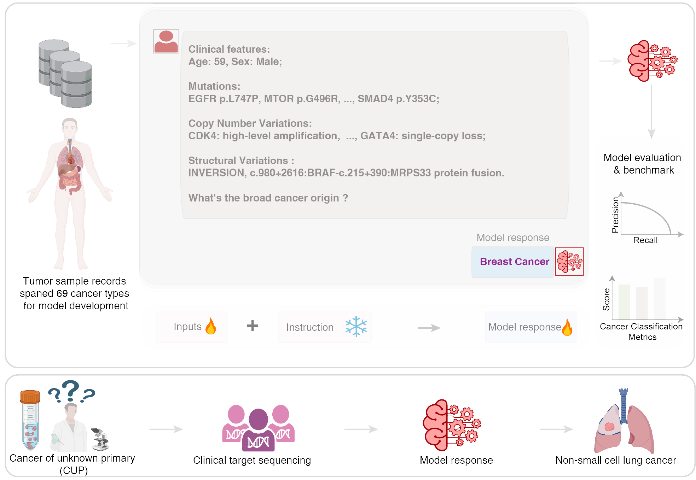

#  Large language models enable tumor-type classification and localization of cancers of unknown primary from genomic data (OncoChat)


## Introduction
Recent advances in artificial intelligence (AI) have highlighted the potential of large language models (LLMs) to revolutionize medical research. Models based on architectures such as Generative Pre-Training (GPT) and Bidirectional Encoder Representations from Transformers (BERT) have demonstrated proficiency in processing vast amounts of unstructured text, including clinical notes, pathology reports, and research publications. In clinical practice, LLMs are being applied to tasks such as medical coding, summarizing patient records, extracting data from electronic health records (EHRs), and assisting with diagnosis. Despite these successes, the application of LLMs in genomic diagnostics remains largely unexplored. 

We introduce OncoChat, a novel diagnostic tool that leverages LLMs to integrate genomic data with clinical information for cancer type prediction. OncoChat enhances existing molecular classifiers by addressing key limitations, incorporating mutations, copy number changes, structure variation in a flexible manner. The model is developed on a dataset of 158,836 across 69 solid tumors, all sequenced using clinically targeted cancer gene panels. OncoChat demonstrates strong performance, particularly in classifying CUP cases. 
 

## System requirements
- Operating systems: CentOS 7.
- [Python](https://docs.conda.io/en/latest/miniconda.html) (version == 3.8.10).
- [PyTorch](https://pytorch.org) (version == 2.2.2+cu118).
- [transformers](https://huggingface.co/docs/transformers/index) (version == 4.41.2).

This example was tested with the following environment. However, it should work on the other platforms. 

## Installation guide
- Following instruction from [miniconda](https://docs.conda.io/en/latest/miniconda.html) to install Python.
- Use the following command to install required packages.
```bash
# Install with GPU support. Check https://pytorch.org for more information. 
#+The following cmd install PyTorch compiled with cuda 118. 
pip install torch --index-url https://download.pytorch.org/whl/cu118

# If GPU not available, install the PyTorch compiled for CPU.
pip install torch --index-url https://download.pytorch.org/whl/cpu

# Install transformers, tokenizers and prettytable
pip install transformers==4.41.2 tokenizers==0.19.1 prettytable
```

- The installation process will take about an hour. This heavily depends on your network bandwidth.

## Demo
- Step1 : Clone `OncoChat` locally from Github.
```bash
git clone https://github.com/deeplearningplus/OncoChat.git
```

- Step 2 : Instruction Fine-tune a LLM:
```bash
sh train-oncochat-mamba-130m.sh
```
To execute this step, set the following parameters:\
(1)`--model_name_or_path` : LLM checkpoints ([LLM used in this study](#llm-used-in-this-study)) \
(2)`--data_path` : Training data (e.g.,`data/CKP-train.json`) \
(3) `--output_dir` : Directory to save the fine-tuned model 

OncoChat is composed of nine different LLMs. The remaining eight models need to be trained following the same steps and used for prediction. The demo training files and prediction results are displayed in the `data` folder.

- Get predictions from the fine-tuned model
```bash
sh predict_mamba-130m.sh
```
Set the following parameters for this step:\
(1)`--model_name_or_path` : Path to the fine-tuned model \
(2)`--data_path` : Test data (e.g.,`data/CKP-test.json`or`data/CUP.json`) \
(3) `--output_file` : Path to save prediction results

Fine-tuned models are available for download from [BaiduDisk](https://pan.baidu.com/s/15mk0tNEhvhXsphovhXUQfw) (Password:1234). You can load these checkpoints for predictions instead of fine-tuning them yourself.


## Dataset used in this study
The  full dataset for fine-tune OncoChat is available at [GENIE](https://doi.org/10.7303/syn55234548).

## LLM used in this study
- Qwen-1.5 : https://huggingface.co/Qwen \
- Mamba : https://huggingface.co/state-spaces


